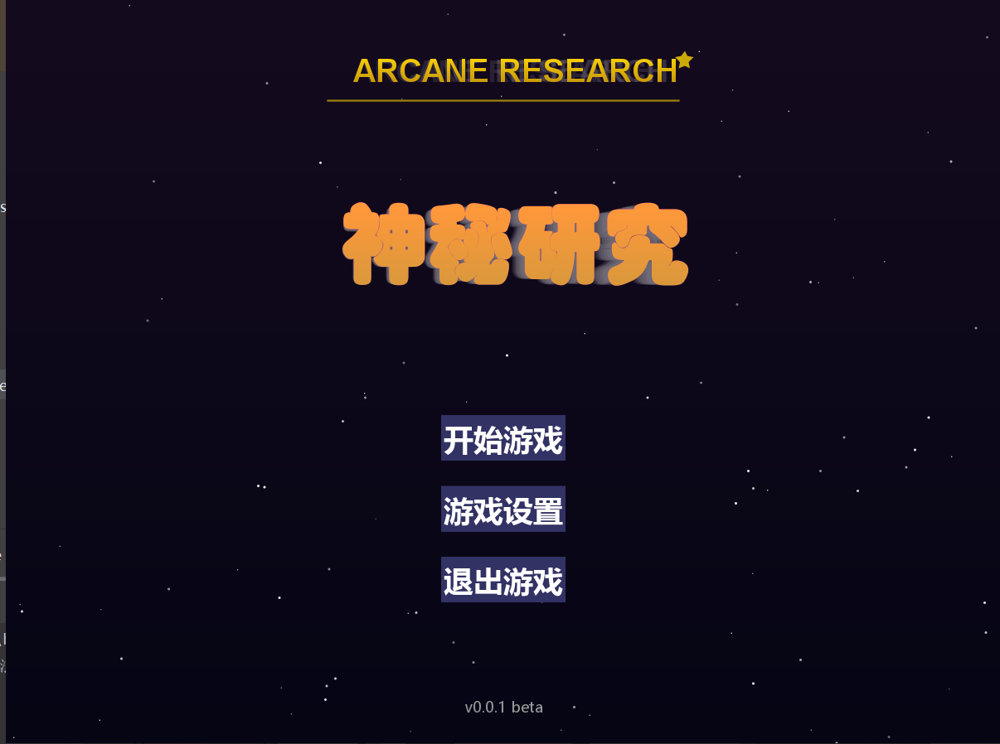
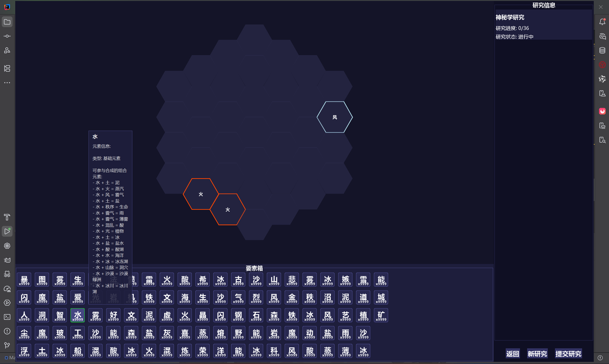
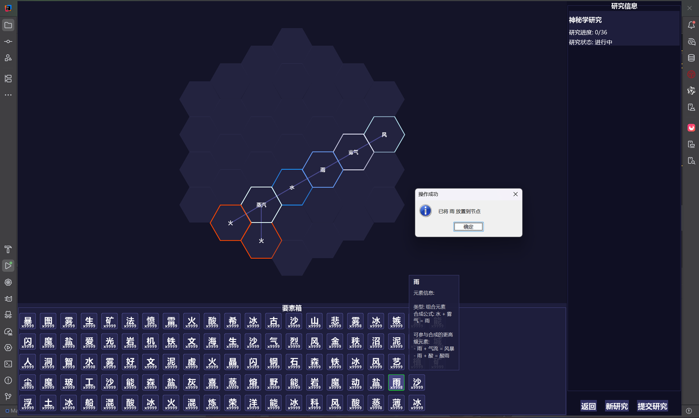

游戏规则如下：

初始状态玩家拥有6种基础元素，分别为风、水、火、土、秩序、混沌

在此基础上两两组合可以生成新的元素，新的元素可以与其组合的元素相连

例如风元素和火元素组合成光明元素，则光明元素可以连接火元素和风元素

基础元素：风、水、火、土、秩序、混沌

组合元素：由基础元素两两组合而成的新元素

要素槽：显示玩家拥有的所有元素

研究节点：六边形的图，每个面可以连接一个元素，若连接槽位在图谱边界，则与边界相接的面无法连接元素

研究笔记：由连研究节点构成的蜂窝状图谱，整张图谱图谱大小随机

初始化时随机在研究笔记边缘随机设置3到10个组合元素

当所有连接节点的顶点相连时，该研究笔记完成研究

游戏截图：

